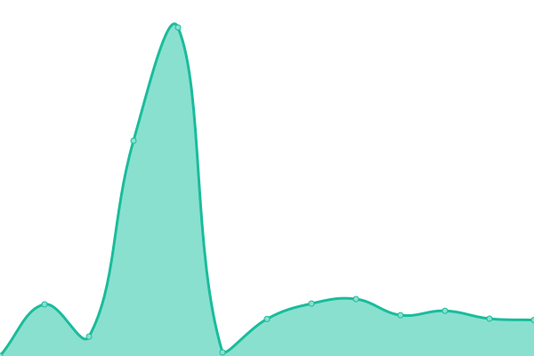
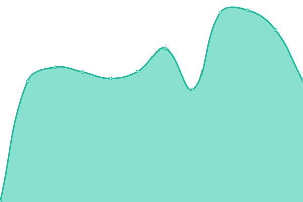

# [📈 Live Status](https://status.comradeturtle.dev): <!--live status--> **🟧 Partial outage**

This repository contains the open-source uptime monitor and status page for [Giorgos Karampitsakis](https://gateway.comradeturtle.dev), powered by [Upptime](https://github.com/upptime/upptime).

With [Upptime](https://upptime.js.org), you can get your own unlimited and free uptime monitor and status page, powered entirely by a GitHub repository. We use [Issues](https://github.com/ComradeTurtle/status/issues) as incident reports, [Actions](https://github.com/ComradeTurtle/status/actions) as uptime monitors, and [Pages](https://status.comradeturtle.dev) for the status page.

<!--start: status pages-->
<!-- This summary is generated by Upptime (https://github.com/upptime/upptime) -->
<!-- Do not edit this manually, your changes will be overwritten -->
<!-- prettier-ignore -->
| URL | Status | History | Response Time | Uptime |
| --- | ------ | ------- | ------------- | ------ |
|  meteora-weather.gr | 🟥 Down | [meteora-weather-gr.yml](https://github.com/ComradeTurtle/status/commits/HEAD/history/meteora-weather-gr.yml) | 

 3440ms
     
 | 

<a href="https://status.comradeturtle.dev/history/meteora-weather-gr">0.00%</a>
    

|  apousies.gr | 🟩 Up | [apousies-gr.yml](https://github.com/ComradeTurtle/status/commits/HEAD/history/apousies-gr.yml) | 

 202ms
     
 | 

<a href="https://status.comradeturtle.dev/history/apousies-gr">100.00%</a>
    

|  Home Assistant | 🟥 Down | [home-assistant.yml](https://github.com/ComradeTurtle/status/commits/HEAD/history/home-assistant.yml) | 

 97ms
     
 | 

<a href="https://status.comradeturtle.dev/history/home-assistant">0.00%</a>
    

|  RIPE Atlas Probe | 🟩 Up | [ripe-atlas-probe.yml](https://github.com/ComradeTurtle/status/commits/HEAD/history/ripe-atlas-probe.yml) | 

 526ms
     
 | 

<a href="https://status.comradeturtle.dev/history/ripe-atlas-probe">99.72%</a>
    

|  [PrimeGrid Challenge Statistics](https://pgapi.comradeturtle.dev/v1/statistics) | 🟩 Up | [prime-grid-challenge-statistics.yml](https://github.com/ComradeTurtle/status/commits/HEAD/history/prime-grid-challenge-statistics.yml) | 

 454ms
     
 | 

<a href="https://status.comradeturtle.dev/history/prime-grid-challenge-statistics">100.00%</a>
    

<!--end: status pages-->

[**Visit our status website →**](https://status.comradeturtle.dev)

## 📄 License

- Powered by: [Upptime](https://github.com/upptime/upptime)
- Code: [MIT](./LICENSE) © [Giorgos Karampitsakis](https://gateway.comradeturtle.dev)
- Data in the `./history` directory: [Open Database License](https://opendatacommons.org/licenses/odbl/1-0/)
